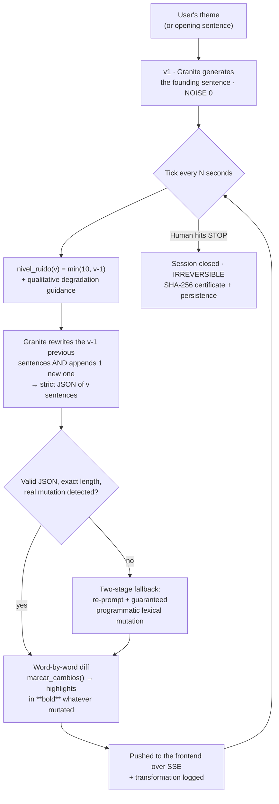

<div align="center">

<pre align="center">
███╗   ██╗ ██████╗ ██╗███████╗███████╗
████╗  ██║██╔═══██╗██║██╔════╝██╔════╝
██╔██╗ ██║██║   ██║██║███████╗█████╗
██║╚██╗██║██║   ██║██║╚════██║██╔══╝
██║ ╚████║╚██████╔╝██║███████║███████╗
╚═╝  ╚═══╝ ╚═════╝ ╚═╝╚══════╝╚══════╝
</pre>

### **The AI never stops writing. You only decide when to say _stop_.**

**NOISE** is a creative writing tool where the work isn't defined by the prompt.
It's defined by **the exact instant you shut the machine down.**

<br>


**AI Creator Challenge with IBM Bob — July 2026 edition**
*Creative industries · AI at the core · IBM Bob as the primary development tool*

<br>

**Built by [Vicente Navas Martínez](https://linkedin.com/in/vicente-navas-martinez-aa8ba63b4) · [Daniel Claver Feito](https://linkedin.com/in/daniel-claver-feito-b34043264/)**

[**Demo video (3 min)**](https://www.youtube.com/watch?v=B-QsKg0smIk)

</div>

---

## 🧨 Problem statement

> You ask an AI to write something. It hands you a perfect text.
> And it would hand **that exact same text** to anyone else who asked for the same thing.

That's the real problem facing the creative industries today. It isn't that AI writes badly — it writes too well, and **too identically for everyone**. The result:

| Symptom | What it means for the creator |
|---|---|
| **Homogenization** | Writers, screenwriters and artists generate work every day that looks like everyone else's. The tool erases the voice instead of amplifying it. |
| **Ghost authorship** | The only human gesture left is *approving* an output. Approving isn't creating. No decision of your own survives inside the work. |
| **Total reproducibility** | If the result can simply be requested again, it isn't a work — it's a query. Nothing irreplaceable is left to claim as yours. |
| **Zero traceability** | Nobody can prove what was generated, how it was transformed, or when the human stepped in. Without evidence, there's no authorship worth defending. |

**The question that set this project off:**
What if, instead of asking the AI for a perfect result, we asked it for a **process**… and the human creative act was **stopping it**?

---

## ⚡ Solution

**NOISE inverts your relationship with the generative model.**

The AI doesn't hand you a finished work: it hands you a work that is **alive and corroding in real time, right in front of you**. Every few seconds the model does two things at once:

1. It **moves forward**, adding exactly **one new sentence** at the end.
2. It **rewrites backwards**, altering every previous sentence — verbs, adjectives, names, places, era and tone.

The **NOISE** level climbs with every version. At first it's nuance. Then mutation. In the end, a different story.

> **A real example of the system's behavior:**
> You start with *a kid from the neighborhood*. You let it run. Nobody edits anything, nobody decides it.
> Ten versions later, that kid **has become a doctor** — and the neighborhood a metropolis, and the night a nightfall.
> You didn't write that transformation. **You only chose when to stop watching.**

### The only control you get: `STOP`

<div align="center">

| Stop early | Stop late |
|:---:|:---:|
| Recognizable work, faithful to the theme | Derived work, unrecognizable, yours |
| High integrity | Almost no integrity left |
| **NOISE 0–3** | **NOISE 8–10** |

</div>

And here's the heart of the project: **stopping is irreversible.** The session closes and cannot be reopened, undone or regenerated (`HTTP 409`, guaranteed by design). There is no "second take". That instant never comes back.

### The certificate: authorship you can prove

At the exact moment you stop, NOISE seals the work into a **SHA-256 certificate** containing:

- The **original prompt** and the **base text** (the faithful version).
- The **exact final text** you chose to freeze.
- The **complete transformation history**: version, NOISE level, *pre* and *post* state, and UTC timestamp for every mutation.
- The **moment of stopping** — the human decision, timestamped.
- A **SHA-256 hash** over all of the above, publicly verifiable at `/api/certificado/verificar`.

Change a single comma in the certificate and the hash stops matching. **The work is yours, and it can be proven.**

### Who it's for

Creators who use AI every day — **writers, screenwriters, artists, content teams** — who need the final result to carry **a decision of their own**, not just a text they signed off on.

---

## 🧠 AI approach and architecture

AI **isn't a feature of NOISE: it is the entire engine of the product.** Without the model there is no work, no degradation, and no decision to make.

### Model

| | |
|---|---|
| **Provider** | IBM **watsonx.ai** (official `ibm-watsonx-ai` SDK) |
| **Model** | **IBM Granite** — `ibm/granite-4-h-small` by default, configurable via `WATSONX_MODEL_ID` |
| **Interface** | `ModelInference.chat` with a *system prompt* + *user prompt* |
| **Structured mode** | `response_format: json_object` for every narrative version |
| **Dynamic temperature** | Scales **with the noise**: `min(0.55 + level × 0.06, 1.0)` — more degradation, more drift |

### Degradation flow



### The four AI engineering decisions that hold the product up

**1️⃣ Noise as a *prompt*, not as post-processing.**
Degradation isn't faked with `random`. It's asked of the model. `nivel_ruido()` maps the version number to a 0–10 level, and `_guia_ruido()` turns that into explicit qualitative instructions ("*extreme noise: characters, place, era, genre and goal may be completely different… yet each version must evolve logically from the immediately previous one*"). The result is **enormous drift overall, coherent step by step** — which is exactly the hard part.

**2️⃣ Structured, validated output — not loose text.**
Granite replies with `{"frases": [...]}` in JSON. The system validates exact cardinality (version N ⇒ N sentences), strips residual formatting and — crucially — **verifies that the previous sentences actually changed**. If the model returns the past untouched, the version is **rejected**. Cumulative corrosion is a guarantee, not a hope.

**3️⃣ Cascading fallback: the show never stops on its own.**
If the primary generation fails or breaks the contract: (a) it retries with a reinforced prompt and higher temperature; (b) if the model still resists, a **programmatic lexical mutation** kicks in over the previous sentences. The only thing that can stop the story is **you**.

**4️⃣ Mutation you can see.**
A word-by-word `difflib.SequenceMatcher` compares each sentence against its previous version and **highlights in bold only what changed**. The user doesn't see a new text: **they watch the text rot.** That tension is what turns "waiting" into a creative decision.

### System architecture

```
┌─────────────────────────── FRONTEND · React 19 + Vite 8 ───────────────────────────┐
│  TestigoView          SetupPanel → LivePanel → ResultPanel                         │
│  useSSEStream (EventSource)   ·   useHealthCheck   ·   useCRTAudio                 │
│  Analog CRT aesthetic: GlitchText, GlitchField, CRTOverlay, FrameSequence          │
└──────────────────────────────────────┬─────────────────────────────────────────────┘
                                       │  SSE (push, no polling) + REST
┌──────────────────────────────────────┴───── BACKEND · FastAPI (async) ─────────────┐
│  routers/testigo.py       Transport, sessions, tick loop, SSE                      │
│  services/narrativa.py    NARRATIVE ENGINE: prompts, NOISE, mutation, diff         │
│  services/granite_client.py   Centralized watsonx.ai client (120s timeout,         │
│                               typed 503/504, sync SDK on asyncio.to_thread)        │
│  services/certificado_service.py   SHA-256 sealing and verification                │
│  SQLAlchemy + SQLite (migratable to PostgreSQL)                                    │
└──────────────────────────────────────┬─────────────────────────────────────────────┘
                                       │
                        ☁️  IBM watsonx.ai — Granite Instruct
```

**Strict separation of concerns:** the router knows nothing about narrative (only HTTP, state and orchestration), `narrativa.py` knows nothing about HTTP (it takes plain data and returns sentences), and `granite_client.py` is the **only** point of contact with watsonx.ai. Switching models means switching one environment variable.

### API

| Method | Endpoint | What it does |
|---|---|---|
| `POST` | `/api/testigo/iniciar` | Opens a session: `prompt`, `contexto`, `velocidad` (1–60 s/tick) |
| `GET` | `/api/testigo/{id}` | Current state: fragments, degradation level, generating flag |
| `GET` | `/api/testigo/{id}/stream` | Real-time **SSE**, with a *heartbeat* every 30 s |
| `POST` | `/api/testigo/{id}/detener` | **IRREVERSIBLE.** Returns the final work + its sealed certificate |
| `POST` | `/api/certificado/verificar` | Recomputes the SHA-256 and confirms or refutes integrity |

---

## 🎯 Selected challenge theme

> **AI Creator Challenge with IBM Bob · July 2026 edition**
> **Category: AI solutions for the creative industries — _storytelling_ tools.**

NOISE is a **generative storytelling tool** aimed at creative professionals, and it meets the challenge on all three of its demands:

| Challenge requirement | How NOISE meets it |
|---|---|
| **AI at the core** | There is no product without the model. Granite generates the work, degrades it version by version, and produces every piece of material the user interacts with. Without watsonx.ai, the screen is empty. |
| **Creative industries** | Built for writers, screenwriters and artists who already use AI daily and suffer the homogenization of their output. |
| **IBM Bob as the primary tool** | The entire development cycle — design, implementation, refactor and the watsonx.ai migration — was carried out with Bob (details below). |
| **Working prototype** | Not a mockup: backend, frontend, SSE streaming, persistence, cryptographic certification and automated tests, all runnable with a double-click. |

It also brings an angle the challenge didn't ask for but the industry needs: **verifiable authorship**. Every work leaves the system with cryptographic evidence of its process and of the instant the human decided.

---

## 🤖 How IBM Bob was used

**IBM Bob was the project's primary development tool, from the first line to the last.** It wasn't used as occasional autocomplete, but as a **pair programmer with context across the whole repository**, driving the work in intent → implementation → review cycles.

### 1. Scaffolding and initial design
Bob generated the project's full skeleton from the product intent: a FastAPI application with routers, SQLAlchemy models (`Obra`, `Certificado`), utilities, and the React + Vite frontend with its component structure. What normally costs an afternoon of *boilerplate* was up and running in minutes, freeing the team's time for what the challenge actually was: **the degradation logic**.

### 2. Building the narrative engine
The core of the product — how to make an LLM degrade **a lot in total but little at a time** — was iterated with Bob: writing and tuning the *system prompt*, designing the 0–10 `nivel_ruido()` scale, the qualitative guidance in `_guia_ruido()`, JSON cardinality validation, and the "nothing actually mutated" detection. Bob made it fast to test prompt phrasings and validation strategies directly against the real code.

### 3. Bob-driven refactor and modularization
With the prototype working, Bob drove the architectural cleanup that gave the repo its current shape (visible in the commit history):
- **Extraction of `services/narrativa.py`**: all narrative logic left the router, which was reduced to transport and orchestration.
- **CSS modularization** of the frontend into `src/styles/*.css`, imported in order from `App.css` to preserve the cascade.
- **Scope pruning**: removal of the "Lab" module from front and back, focusing the product on its strongest proposition (Witness Mode + Verify).
- **Language and documentation conventions** unified across the codebase.

### 4. Migration to IBM watsonx.ai
The project's decisive step. With Bob, the local inference provider was replaced by the **official `ibm-watsonx-ai` SDK** under one self-imposed constraint: **`generar_texto()` had to keep exactly the same signature and return contract** (`{texto, tokens_usados}`) so that not a single line of the narrative engine would change. Bob implemented the centralized client with a `ModelInference` cache, the synchronous SDK executed off the *event loop* via `asyncio.to_thread`, `wait_for` with a 120 s timeout, and typed 503/504 errors. The result: a provider migration **without touching `narrativa.py`**.

### 5. Streaming, tests and robustness
Bob assisted in the move from *polling* to **Server-Sent Events** (per-subscriber queues, heartbeats, subscriber cleanup), in writing the `pytest` suite with model *mocks* — the tests run **without watsonx credentials** — and in closing the edge cases: double stop (`409`), task cancellation with `shield` + timeout, and session resource release after closing.

> **In short:** Bob was the copilot that let a small team ship, inside the challenge window, a system with a non-trivial AI engine, real-time streaming, persistence, cryptography and tests — instead of a one-screen demo.

*IBM SkillsBuild activity on Bob: completed.*

---

## 🚀 Getting started

### Requirements
- **Python 3.11+**
- **Node.js 18+**
- An **IBM watsonx.ai** account with an *API key* and a project

### 1 · Backend

```bash
cd backend
pip install -r requirements.txt
cp .env.example .env      # fill in your credentials
uvicorn app.main:app --reload --port 8000
```

> *You should rename de .env.expample to .env with your credentials*
> 
`.env`:

```env
WATSONX_APIKEY=your_api_key
WATSONX_PROJECT_ID=your_project_id
WATSONX_URL=https://eu-de.ml.cloud.ibm.com
WATSONX_MODEL_ID=ibm/granite-4-h-small
```

> *API key*: [IBM Cloud](https://cloud.ibm.com) → **Manage → Access (IAM) → API keys**.
> *Project ID*: the **Manage** tab of your watsonx.ai project.

### 2 · Frontend

```bash
cd frontend
npm install
npm run dev          # http://localhost:3000
```

### ⚡ Shortcut (Windows)

```bash
start.bat            # boots backend + frontend and opens the browser
```

### Tests

```bash
cd backend && pytest tests/ -v
```

---

## 🗂️ Structure

```
NOISE/
├── backend/
│   ├── app/
│   │   ├── main.py                      # FastAPI entry point
│   │   ├── database.py                  # SQLAlchemy
│   │   ├── routers/
│   │   │   ├── testigo.py               # Witness Mode: HTTP, SSE, sessions, ticks
│   │   │   └── certificado.py           # Certificate verification
│   │   ├── models/                      # Obra · Certificado
│   │   ├── services/
│   │   │   ├── granite_client.py        # ☁️  IBM watsonx.ai client (Granite)
│   │   │   ├── narrativa.py             # 🧠 Narrative degradation engine
│   │   │   └── certificado_service.py   # 🔒 SHA-256 sealing and verification
│   │   └── utils/                       # hash · json_extractor
│   └── tests/                           # pytest with model mocks
├── frontend/
│   └── src/
│       ├── components/{testigo,ui,layout,common}/
│       ├── hooks/                       # useSSEStream · useHealthCheck · useCRTAudio
│       ├── styles/                      # Modular CSS (order = cascade)
│       └── api/api.js                   # Backend client
└── start.bat
```

---

## 🎛️ The aesthetic: analog signal

NOISE doesn't look like an AI app, and that's deliberate. The interface is a **CRT monitor**: scanlines, RGB split, *glitch*, signal noise and ambient tube hum. Because what you're watching **isn't an answer — it's a broadcast decaying**, and the only way to keep it is to cut it.

Black and electric for the system. **Yellow is reserved, across the entire application, for one thing only: the certificate.** What survives.

---

<div align="center">

### The AI writes infinite versions.
### Only one is yours: **the one you decided not to let continue.**

<br>

**NOISE** — AI Creator Challenge with IBM Bob · July 2026
Built with **IBM Granite** on **watsonx.ai**, developed with **IBM Bob**

</div>
